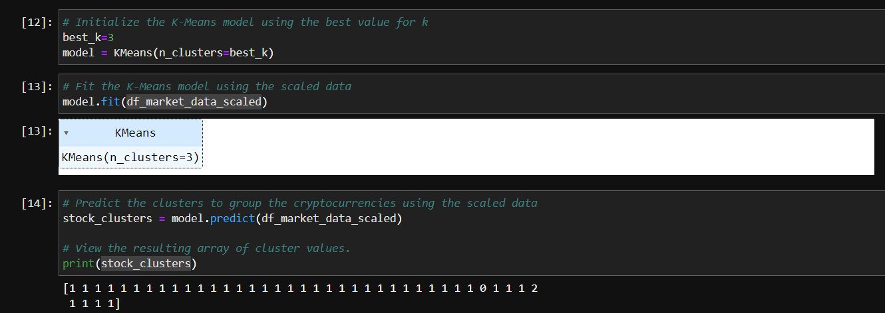

# Module_10_Challenge
# Crypto Clustering

Hello, This project is about Crypto clustering, or cryptocurrency clustering, refers to the process of grouping cryptocurrencies into distinct clusters based on certain characteristics or features.

---

## Technologies

pandas is a software library written for the Python programming language for data manipulation and analysis. Clustering techniques are used to identify similarities or patterns in the data and classify cryptocurrencies into groups that exhibit similar behavior or have similar attributes.

---

## Installation Guide

---

## Usage

---

## Contributors

-Name: John Nguyen
-Email: nguyenjohn1337@gmail.com

---

## License

When you share a project on a repository, especially a public one, it's important to choose the right license to specify what others can and can't with your source code and files. Use this section to include the license you want to use.

Specify the details of your project’s license - that is, how others can or cannot use your code and files.
